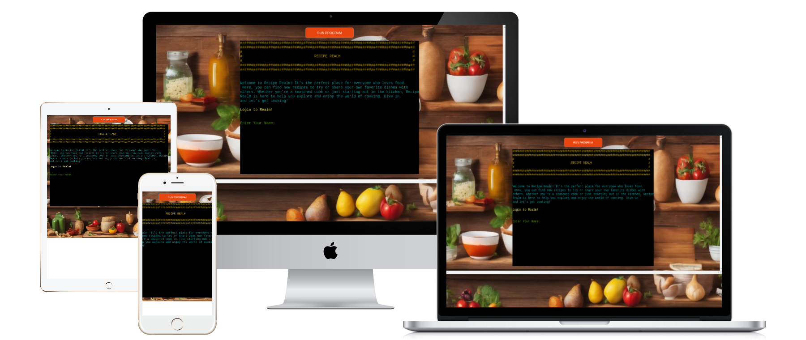
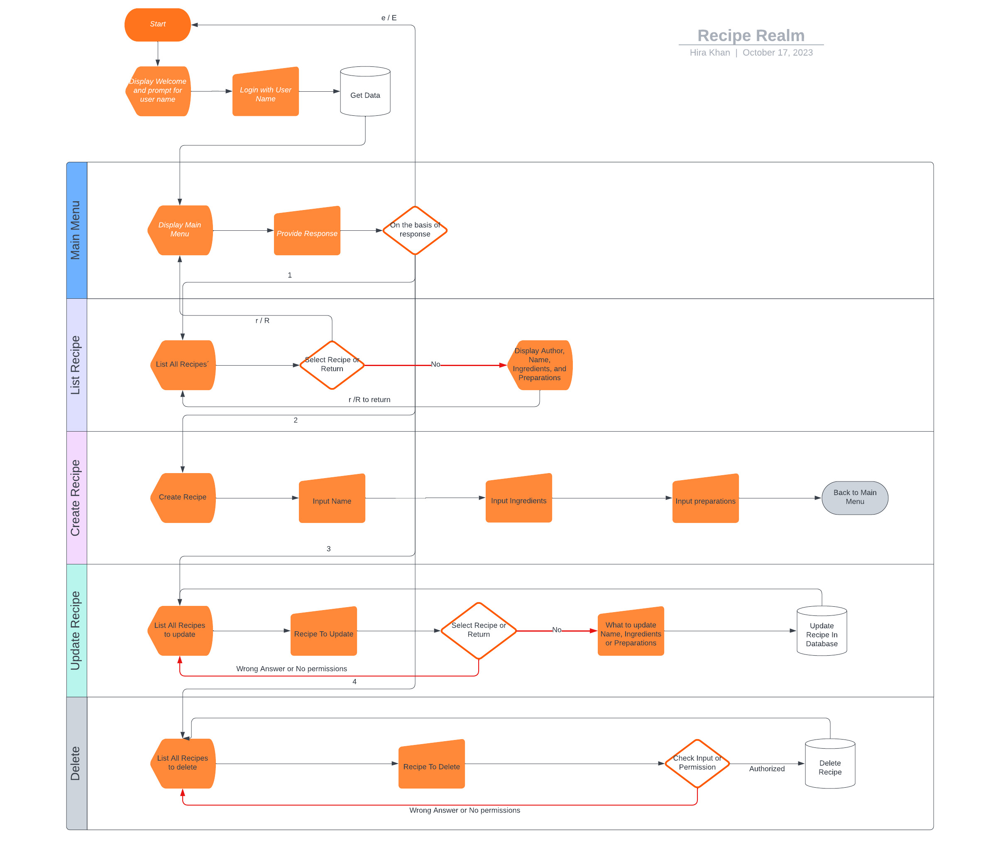
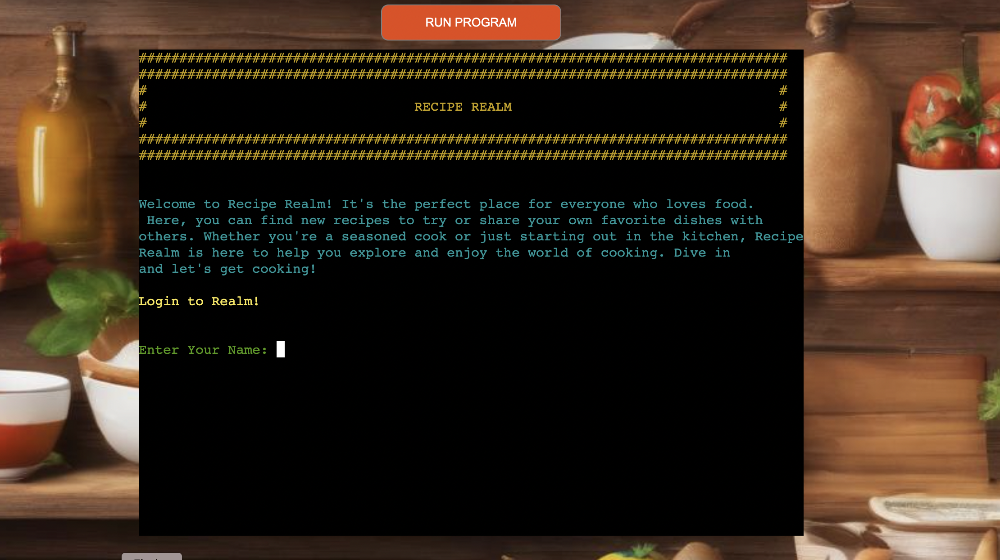
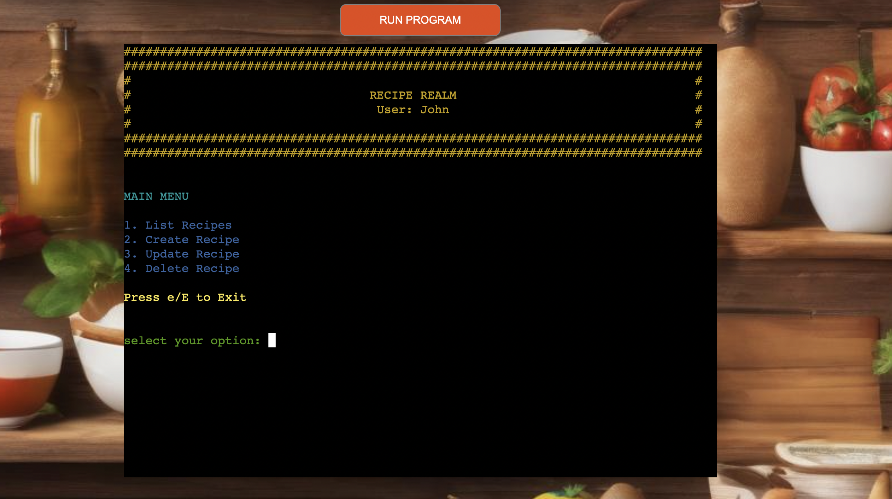
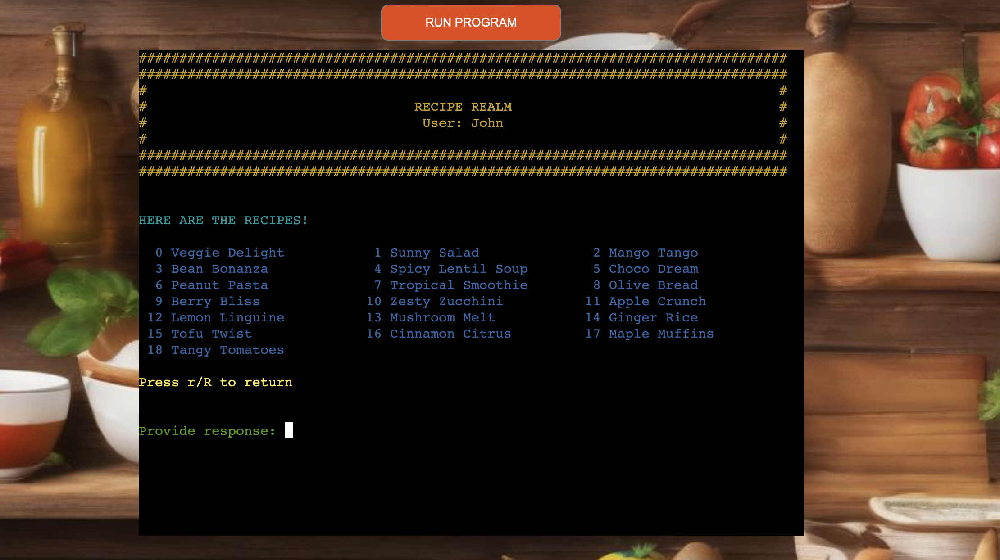
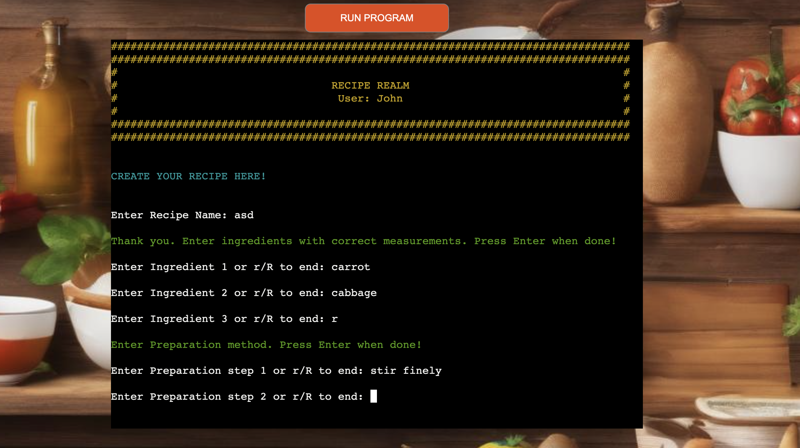
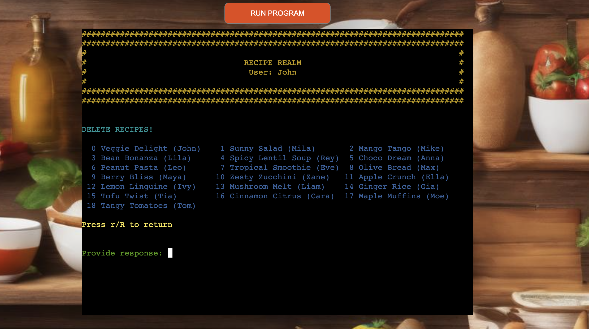

# Recipe Realm

Recipe Realm is a Python terminal application that operates within the mock terminal of Heroku. Users can effectively 
manage recipes by viewing others', creating their own, updating them, and deleting them according to their specific 
needs. 

A hierarchical structure is maintained wherein only the admin has the privileges to perform all functionalities.
However, if the user is not an admin, they can only modify or delete their own recipes, ensuring the integrity of other 
users' recipes.

Live application is available on this link [Recipe Realm](https://recipe-realm-project-f9c4db7b71c2.herokuapp.com/)



Recipe Realm offers a simple and intuitive interface to organize your recipes.

1. **List Recipes**: View all the recipes in one place.
2. **Create Recipe**: Add a new recipe, complete with recipe name, ingredients and preparation.
3. **Update Recipe**: Want to change something in existing dish? Easily modify any part of your recipe.
4. **Delete Recipe**: Clear out recipes you no longer need with just one click.

## Table of Contents
- [Introduction](#introduction)
- [Features](#features)
  * [Flowchart](#flowchart)
  * [Login Page](#login-page)
  * [Main Menu](#main-menu)
  * [List Recipes](#list-recipes)
  * [Create Recipe](#create-recipe)
  * [Update Recipe](#update-recipe)
  * [Delete Recipe](#delete-recipe)
- [Testing](#testing)
- [How to Use](#how-to-use)
  * [Install Requirements](#install-requirements)
  * [Run program](#run-program)
- [Bugs](#bugs)
  * [Solved Bugs](#solved-bugs)
  * [Remaining Bugs](#remaining-bugs)
- [Deployment](#deployment)
- [Credits](#credits)

## Features

### Flowchart



### Login Page
- Description of the application is available on this page
- user can enter here their name


### Main Menu
- Main menu where user can go to whatever option they want to go
- user can also press E to end the application


### List Recipes
- Browse through all the dishes.
- Simply enter the number to quickly see the recipe of your desired dish.


### Create Recipe
- Add recipe name, ingredients, and detailed cooking steps.
- Your recipe will be automatically saved.


### Update Recipe
- Edit any part of the recipe, whether it's the name of the recipe, ingredients, or the cooking process.
[list](./assets/images/update.png)

### Delete Recipe
- A simple one-click process to remove unwanted recipe.


## Testing

Extensive testing ensures a seamless experience:

- Manual testing of each feature for functionality and user experience in my terminal and Code Institute Heroku terminal.
- Conducted user tests to gather feedback and further refine the application.
- Passed the code through PEP8 Linter and confirmed there are no problems.

## How to Use

### Install Requirements
1. Install Python 3.8+
2. Install requirements.txt
   ```shell
   pip install -r requirements.txt
    ```

### Run program

Using the following command you can easily start the program
```shell
python run.py
```

It can also be executed using module command easily
```shell
python -m src
```

## Bugs

### Solved Bugs
- Update function was not callable. I explicitly imported update recipe function in menu.py
- Sometimes limit cross from google sheet APIs. This was resolved by try catch sleep in while loop.
- Shutil doesnt create better columns understanding for text center resolved by providing columns number to center itself.
- HTML doesnt take pictures from assets. Resolved by providing cdn links.

## Remaining Bugs
- Clear screen function does also show previous displayed results in screen on scroll
- Javascript terminal sometimes stuck with throwing any error on inputs
- On updating a single recipe if the wrong selection is made, the error message shows up after a correct entry. Only enter the correct value 

## Deployment
The project was deployed on Heroku. The following steps were taken for deployment:

- Add dependencies to requirements.txt file with command "pip3 freeze > requirements.txt"
- Commit and push to GitHub
- Go to the Heroku Dashboard
- Click "Create new app"
- Name app and select location
- Add Config Vars for Creds and Port in Settings tab
- Add the buildbacks to Python and NodeJS in respective order
- Select appropriate deployment method, GitHub
- Connect to Github and link to repository
- Enable automatic deployment and/or deploy manually
- Click on Deploy

## Credits

- All the culinary enthusiasts for their valuable feedback.
- Code institute Love Sandwich's walk through project for step by step explanation.
- Various online free resources to have the idea of the project.
- Gencraft.com for the background image.

